# DIGIX Asset Ops — User Manual

**Version 1.0 · 28 September 2026**

---

## Document control

| | |
|---|---|
| **Document title** | DIGIX Asset Ops — User Manual |
| **Document reference** | DIGIX-UM-001 |
| **Current version** | 1.0 |
| **Status** | Issued for review |
| **Issue date** | 28 September 2026 |
| **Applies to build** | `feat/maintenance-tickets-sep21` (backend + frontend) |
| **Owner** | DIGIX implementation team |
| **Source of truth** | `docs/DIGIX_Asset_Ops_User_Manual.md` in the frontend repository |
| **Classification** | Internal — DIGIX and client personnel only |

### Revision history

Every issue of this manual is recorded here. The version number rises by a
whole number when the structure changes or a module is added, and by a
tenth when wording, screenshots or a procedure are corrected.

| Version | Date | Author | Section(s) | Description of change | Approved by |
|---|---|---|---|---|---|
| 1.0 | 28-Sep-2026 | DIGIX implementation team | All | First issue. Covers all 21 screens, the role and permission system, and the six end-to-end workflows. | *pending* |
| | | | | | |
| | | | | | |

### How to revise this manual

1. Raise the change against the current version — quote the section number.
2. Edit the source file `docs/DIGIX_Asset_Ops_User_Manual.md` on a branch.
3. Re-take any screenshot the change affects (see §16.3) so the picture
   matches the words.
4. Add a row to the revision history above. Never overwrite an existing
   row — a superseded instruction is part of the record.
5. Raise a pull request into `staging`. The reviewer named in the
   *Approved by* column signs the row off on merge.

The manual lives beside the code it describes, so the version that shipped
with any build can always be recovered from the repository history.

### Related documents

| Reference | Document | Purpose |
|---|---|---|
| DIGIX-AM-002 | `DIGIX_Authority_Matrix_v2_signed.xlsx` | The signed organogram and role mapping this system is configured from |
| DIGIX-CRS-001 | `Comment_Resolution_Sheet_CONSOLIDATED_28-9-26.xlsx` | Client comments and their resolutions |
| DIGIX-RR-003 | `DIGIX_Roles_and_Responsibilities_Matrix.xlsx` | The authority matrix behind the default permissions |
| — | `DIGIX_Team_Logins.xlsx` | First-login credentials. **Confidential — delete after handover.** |

---

## Contents

**Part A — Before you start**
1. [About this manual](#1-about-this-manual)
2. [Signing in](#2-signing-in)
3. [Finding your way around](#3-finding-your-way-around)
4. [What you are allowed to do](#4-what-you-are-allowed-to-do)

**Part B — The screens**
5. [Dashboard](#5-dashboard)
6. [Assets](#6-assets)
7. [Projects](#7-projects)
8. [Procurement](#8-procurement)
9. [Inventory](#9-inventory)
10. [Installation Tracker](#10-installation-tracker)
11. [Maintenance](#11-maintenance)
12. [Tickets](#12-tickets)
13. [Warranties](#13-warranties)
14. [Everything else](#14-everything-else)

**Part C — Doing the work**
15. [The six workflows end to end](#15-the-six-workflows-end-to-end)

**Part D — Reference**
16. [Reference](#16-reference)

---

# Part A — Before you start

## 1. About this manual

### 1.1 Who this is for

Everyone who uses DIGIX Asset Ops: the Group Head, the Operation and CS
Leads, supervisors, the store, the CS desk and the technicians in the
field. It assumes no prior knowledge of the system.

You do not need to read it end to end. Part B has one chapter per screen —
find the screen you are on. Part C traces the six jobs the system exists to
do, from start to finish, naming the screen and the button at every step.

### 1.2 What the system is for

DIGIX Asset Ops follows a digital display asset through its whole life:
bought or built, held in stock, assigned to a project, installed at a
client's site, kept running, and eventually handed to the client or
retired. Around that spine sit the things that serve it — purchasing,
stock, maintenance, tickets, warranties and the money.

### 1.3 Conventions used here

| Convention | Meaning |
|---|---|
| **Bold** | A button, tab or field exactly as it appears on screen |
| `Code` | A status value, a code, or something you type |
| → | "then", in a sequence of clicks |
| ⚠ | A rule the system enforces — it will stop you |
| 💡 | Something worth knowing that is not obvious |

Where a field is marked with a star on screen — **Supplier \*** — it is
required and the form will not save without it.

---

## 2. Signing in

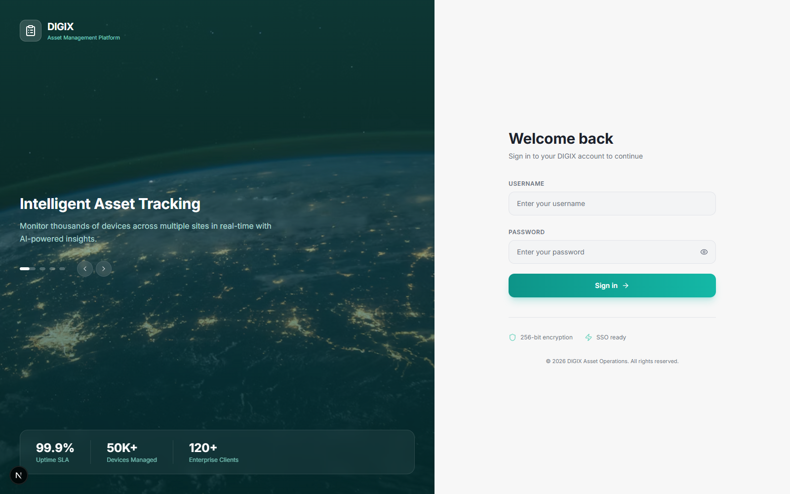

### 2.1 Your first sign-in

1. Open the address your administrator gave you.
2. Enter your **username** and **password** from the credentials sheet you
   were issued.
3. Change your password immediately — see §2.3.

Your username is your own; it is usually your first name. Passwords on the
issued sheet are first-login passwords only.

⚠ **The credentials sheet is the only copy of those passwords.** The system
stores them scrambled and cannot show them again. If you lose yours, an
administrator has to issue a new one.

### 2.2 If you cannot get in

| What you see | What it means | What to do |
|---|---|---|
| "No account with that username" | The username is wrong | Check the sheet — it is case-sensitive |
| "Your account has been deactivated" | Somebody switched the account off | Ask your line manager |
| Wrong-password message | The password is wrong | Try again; after that ask for a reset |

### 2.3 Changing your password

**Settings** (bottom of the sidebar) → change your password there. Do this
on your first day.

---

## 3. Finding your way around

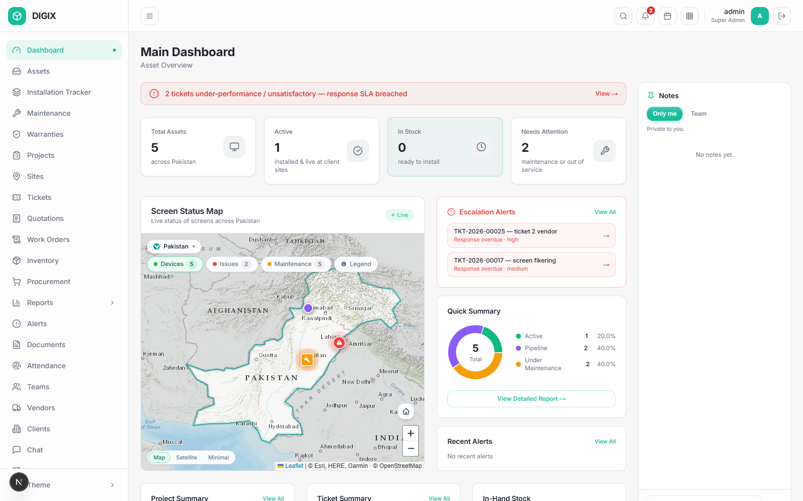

Three parts to every screen.

### 3.1 The sidebar (left)

Your way into every module. **You will not see all of it** — the sidebar
only shows what your role allows, so a technician's sidebar is much shorter
than the Group Head's. That is normal and not a fault.

Clicking a section you are already inside takes you back to its list. If
you are looking at one asset and click **Assets**, you return to the asset
register.

At the bottom: **Theme**, which switches between light and dark.

### 3.2 The top bar

- **Search** — across the system
- **Notifications** (the bell, with a count) — click for the list, **Mark
  all read**, or **View all alerts**
- **Your name and role**
- **Logout** — the right-hand icon

### 3.3 The page itself

Most list screens share a shape:

- A **heading** saying what the screen is for
- **Tiles** across the top — these are also filters; click one to narrow
  the list to it
- A **filter bar** with dropdowns and a search box
- The **list**, ten rows to a page
- **Buttons top right** for the main actions

💡 The tiles are filters, not just counters. Clicking **Under Maintenance**
on the asset screen lists exactly those assets. Clicking it again clears it.

---

## 4. What you are allowed to do

This is the part most worth understanding, because it explains why your
screen differs from a colleague's.

### 4.1 Two separate ideas

| | What it is | Where it lives |
|---|---|---|
| **Job title** | Your place in the organisation — "Store Supervisor", "Karachi SMD Operator" | Shown on your record and in the organogram |
| **System role** | What the software lets you do | Drives every button you can see |

They are deliberately separate. Two people can both be "Supervisor" in the
system while holding quite different jobs.

### 4.2 Capabilities

Underneath the roles sit **30 capabilities** — named permissions grouped
into eleven areas: Money, Procurement, Inventory, Assets, Projects,
Installation, Tickets, Maintenance, Commercial, People and System.

Your role grants a set of them. Any single one can then be granted or
withdrawn for you personally without changing your role.

**The one you will notice most is "See prices and costs".** Without it,
every figure in the system — unit costs, order totals, stock valuations —
comes back blank. This is enforced by the server, not merely hidden on
screen, so it holds however the data is reached.

### 4.3 Who may change permissions

| You are | You may change permissions for |
|---|---|
| Super Admin | Anyone |
| Group Head | Anyone |
| A team lead (Operation Lead, CS Lead, a Supervisor) | Your own team, however far down it runs |
| Anyone else | Nobody |

Two rules apply to everybody, including the Group Head:

⚠ **Nobody edits their own permissions.** Authority you can widen yourself
is not authority. Ask someone above you.

⚠ **Nobody grants what they do not have.** A supervisor without "See
prices" cannot give it to their technician.

### 4.4 The default roles

| Role | Typically held by | Broadly |
|---|---|---|
| Super Admin | MIS Operator | Everything, including user administration |
| Group Head | Group Head | Everything |
| Operations Head | Operation Lead | Assets, projects, sites, procurement, maintenance; sees prices |
| Marketing Head | CS Lead | Client-facing work, quotations, tickets; sees prices |
| Supervisor | Production and Execution Supervisors | Their crew's work, inspections, maintenance; **no prices** |
| Warehouse Staff | Store Supervisor | Goods in, stock, issuing; **no prices** |
| Marketing | CS desk, Graphic Designer | Tickets and quotations; read-only elsewhere |
| Technician | Operators, workers, riders | Their own assigned work only |
| Finance | Finance | Money, reports; read-only on operations |
| Client Viewer | External client contact | Read-only, filtered to their own client |
| Vendor | Supplier portal | Their own tickets only |

These are starting points. See §14.3 for changing them.

---

# Part B — The screens

## 5. Dashboard


**Sidebar: Dashboard · Everyone sees this**

Where you land. Read-only — nothing here changes data.

### 5.1 What is on it

| Panel | Tells you |
|---|---|
| **Four tiles** | Total Assets · Active · In Stock · Needs Attention. Each is a link into a filtered asset list |
| **Screen Status Map** | Every asset with a site, pinned. Colour = status; a red pin has an open ticket, amber is in maintenance |
| **Escalation Alerts** | Tickets that have breached their response time |
| **Quick Summary** | The fleet split by status |
| **Project / Ticket Summary** | Counts by state, each a link |
| **In-Hand Stock** | Components you are watching, with quantity and value |
| **Notes** (right) | See §5.3 |

### 5.2 The map

Three grounds, chosen top-left: **Map** (roads and terrain), **Satellite**,
**Minimal**. The chips along the top switch what is plotted — **Devices**,
**Issues**, **Maintenance** — and **Legend** explains the markers. Zoom and
the home button are bottom-right.

💡 If the legend covers something, close it with the **×** in its corner or
press **Escape**.

### 5.3 Notes

A noticeboard down the right, in two parts:

- **Only me** — private. Nobody else ever sees these.
- **Team** — shared with everyone, and signed with your name.

Type `@` to tag a colleague; the system offers names as you type. Tagging
someone on a team note puts it in their notifications. Press **Enter** to
post, **Shift+Enter** for a new line.

---

## 6. Assets

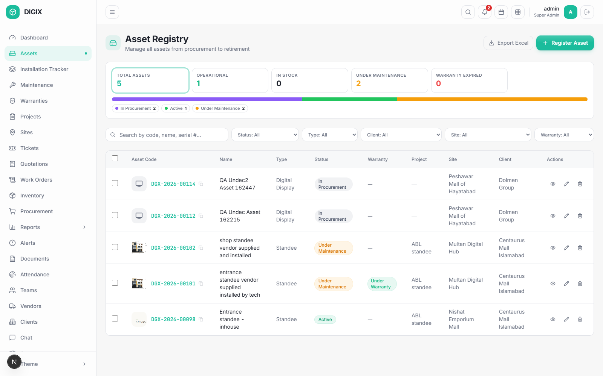

**Sidebar: Assets · Super Admin, Group Head, Operations Head, Technician**

The register of every display you own, from purchase to retirement.

### 6.1 The list

**Tiles:** Total Assets · Operational · In Stock · Under Maintenance ·
Warranty Expired — all clickable filters.

**Filters:** Status, Type, Client, Site, Warranty.
**Search:** by code, name or serial number.

**Columns:** Asset Code · Name · Type · Status · Warranty · Project · Site ·
Client · Actions.

**Buttons:** **Export Excel**, **Print labels (n)** when rows are ticked
(maximum 200 at a time), and **Register Asset**.

### 6.2 Registering an asset

**Register Asset** opens the form.

⚠ **Three fields are required**: **Name**, **Asset Type** and
**Manufacturing Route**. The form will not save without them — this stops
blank assets appearing in the register.

**Manufacturing Route** is the important choice:

| Route | Meaning |
|---|---|
| In-house Production | You build it from components. It goes through production and consumes stock |
| Vendor / Turnkey | It arrives complete from a supplier. No production stage |

### 6.3 The asset lifecycle

Open an asset and the **Product Details** tab opens on the lifecycle rail:

```
In Procurement → In Production → In Stock → Assigned → Installed → Active
                                                 ⌐ Under maintenance
                                    ⌙ ⌙ ⌙ ⌙ ⌙ Client Property · Decommissioned
```

Each step shows **Completed**, **In Progress** or **Not Started**, with the
date it was reached.

**The lifecycle follows the work.** You do not drive it by hand:

| Stage moves to | When |
|---|---|
| In Production | Components are issued to the build |
| In Stock | The build is complete |
| Assigned | You assign it for installation |
| Installed | The technician completes the installation checklist |
| Active | The technician confirms on site with a photo |
| Under Maintenance | A maintenance job opens, or a ticket is raised |

Only two are a human decision, under **Next stage**: **Client Property**
(handing it over) and **Decommissioned** (retiring it).

**Under maintenance** hangs below Active rather than sitting on the line,
because the asset comes back from it.

### 6.4 The other tabs

| Tab | Holds |
|---|---|
| **Warranties** | Cover on this asset — vendor's to you, and yours to the client |
| **Costs & Pricing** | What it cost and what it is worth. *Blank if you cannot see prices* |
| **Documents** | Files filed against it |
| **Maintenance History** | Every visit |
| **Lifecycle** | The full audit trail — who moved it, when, and why |

### 6.5 Components and serial numbers

The **Components** section lists what the asset is built from. Each row
shows its **Kind**:

- **Generic stock** — interchangeable, counted (cable, brackets)
- **Unique item** — serialised and individually tracked

For a unique component the **Serial #** column shows exactly which physical
unit went in, so you can trace any serial from goods-in to the asset it
ended up inside.

⚠ Once a project is in execution its components and production route are
fixed — the approved budget priced *that* parts list. The status still
moves; the parts list does not.

---

## 7. Projects

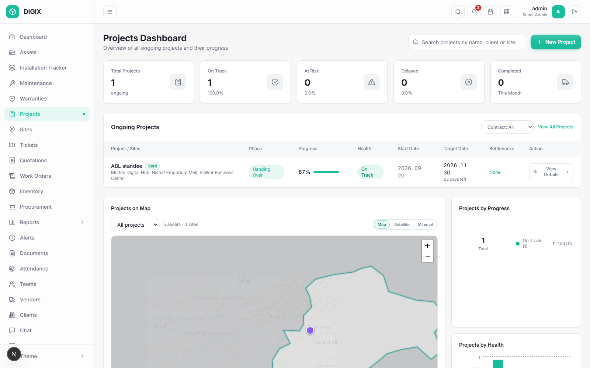

**Sidebar: Projects · Super Admin, Group Head, Operations Head**

A project is a client order: a number of assets, at one or more sites, to a
date.

### 7.1 The dashboard

Tiles for Total / On Track / At Risk / Delayed / Completed, the ongoing
project list, three summary cards, and **Projects on Map**.

On the map, pick a project from the dropdown and its assets light up while
everything else greys back, so you can see where that job actually is.

### 7.2 Phases

A project moves through phases, and **the phase follows the work** — it is
worked out from what is finished, not typed in.

**On Hold** and **Order Lost** are the exceptions: somebody chooses those,
and they override the calculation. Clicking either again lifts it and the
project returns to wherever the work actually stands.

### 7.3 Scope, BOQ and budget

1. **Scope** — which assets, how many, at which site.
2. **Planning / BOQ** — what each asset is built from, and what that costs.
3. **Budget** — arrived at from the plan.

⚠ **The budget is not typed when the project is created.** It is what
planning arrives at and approval freezes. Once approved, the parts list and
route are locked.

---

## 8. Procurement

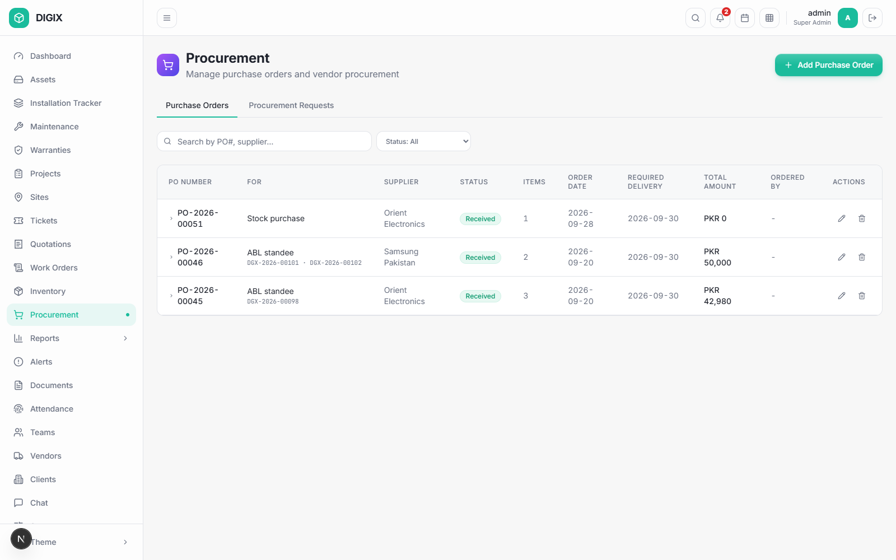

**Sidebar: Procurement · Super Admin, Group Head, Operations Head, Finance,
Warehouse, Supervisor**

Two tabs: **Purchase Orders** and **Procurement Requests**.

### 8.1 Where orders come from

| Source | Raised by | Appears as |
|---|---|---|
| A project needs a component it has not got | The project | A line under Procurement Requests |
| Stock fell below its minimum | Inventory | A stock replenishment request |
| Somebody buys something outright | You | A hand-raised order |

### 8.2 Procurement Requests

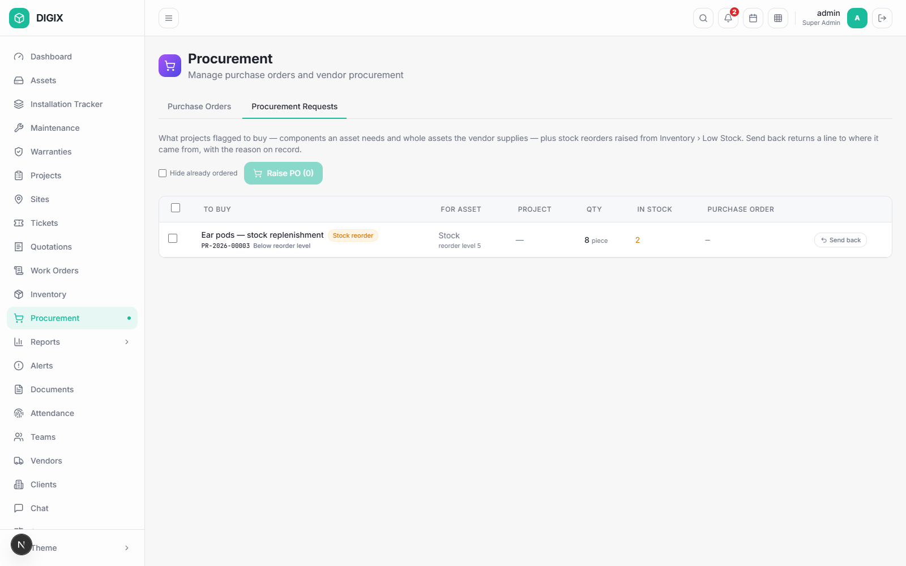

Everything waiting to be bought. Tick the lines you want on one order and
press **Raise PO (n)**.

**Send back** returns a line to whoever raised it, with your reason — use
this instead of cancelling, so the requester finds out why.

### 8.3 Raising a purchase order

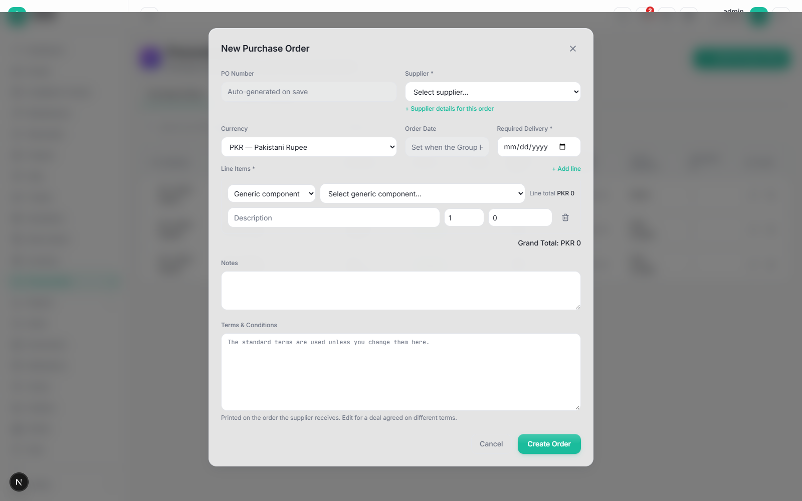

**Add Purchase Order** and **Raise PO** open the same form and collect the
same things:

| Field | Notes |
|---|---|
| **PO Number** | Generated on save |
| **Supplier \*** | Required. **+ Supplier details for this order** adds a contact, quote reference or delivery address |
| **Currency** | |
| **Order Date** | Read-only — stamped when the Group Head approves |
| **Required Delivery \*** | Required before the order leaves draft |
| **Line Items \*** | See below |
| **Notes**, **Terms & Conditions** | The standard terms apply unless you change them |

Each line says what it buys:

- **Generic component** — from stock definitions
- **Unique component** — a serialised type
- **Asset** — a complete asset already registered, awaiting purchase
- **Charge (free text)** — freight, installation, anything not goods

**+ Add line** adds more. On a PO raised from requests, the requested lines
are listed first with their prices editable, and anything extra goes
underneath.

### 8.4 Approval and receiving

```
Draft → Pending Approval → Approved → (goods arrive) → Partially Received → Received
```

⚠ **An order cannot leave Draft without a Required Delivery date.** If you
press **Submit for Approval** without one, the bar asks you for it there and
then — fill it in and press **Set date and continue**.

⚠ **Approval places the order.** The Group Head's signature is what commits
the company and stamps the order date, so there is no separate "mark as
ordered" step. An approved order is received against directly.

**Cancelling an order** returns everything it covered to the queue, so it
can be raised again.

---

## 9. Inventory

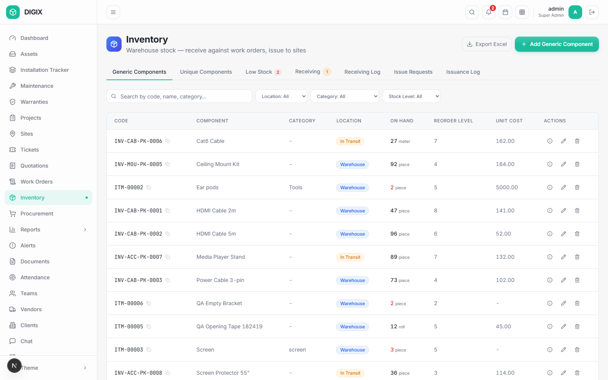

**Sidebar: Inventory · Super Admin, Group Head, Operations Head, Warehouse**

### 9.1 Two kinds of component

| | Generic | Unique |
|---|---|---|
| Example | Cat6 cable, brackets | A media player, an SMD module |
| Tracked by | Quantity | Individual serial number |
| On issue | A number comes off the count | A named unit leaves |

Both are managed the same way, with the same vocabulary throughout.

### 9.2 Receiving

Goods arrive against a purchase order. Receiving records what actually
turned up, which may be less than ordered. Each line is then **inspected** —
passed into stock or rejected.

For unique components the serial numbers are captured at the door, which is
what makes an individual unit traceable from then on.

⚠ Charges (freight and the like) are not goods and do not appear on the
receiving form.

### 9.3 Issuing

⚠ **Stock is issued against a request, not handed out.** The technician or
project asks, a supervisor approves, the store issues. This is what keeps
the count honest.

The issue queue shows who asked, for which asset and project, and what it
is for — a build requirement or a maintenance job.

### 9.4 Low stock

Components with a minimum level raise a replenishment request automatically
when they fall below it. If Procurement sends one back, the reason appears
here so nobody raises it again blind.

---

## 10. Installation Tracker

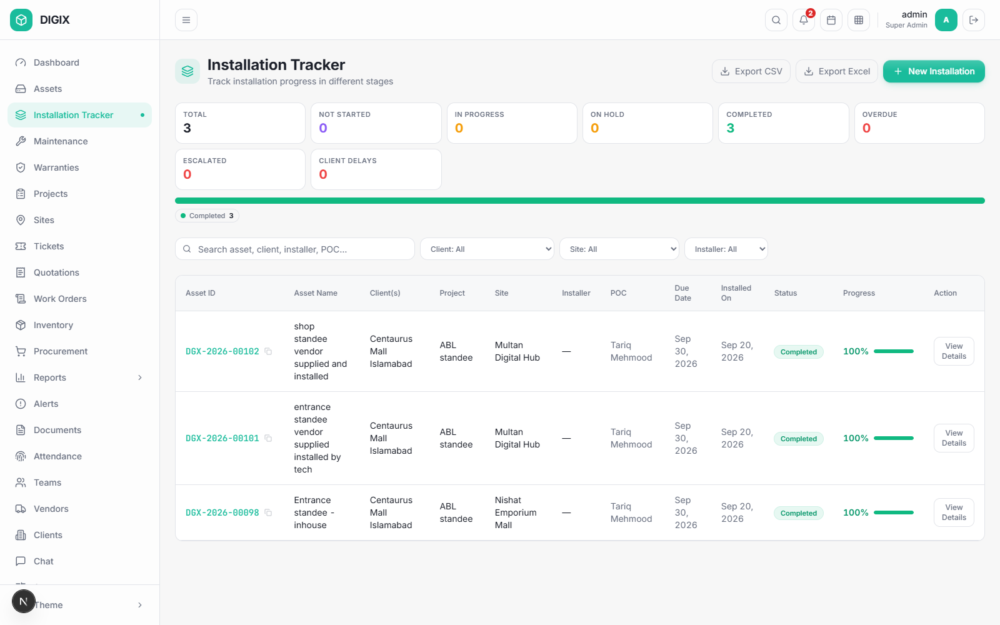

**Sidebar: Installation Tracker · Super Admin, Group Head, Operations Head,
Technician**

### 10.1 The checklist

Each installation has a pipeline of steps — Survey, Wiring, Metal
Structure, Testing, and any you add. **Pipelines can be 3 steps or 10**:
untick what does not apply and add your own when creating the installation.

Each step is Not Started, In Progress, On Hold, Completed or Skipped.
**Flag Delay** records who caused it — Client, Internal, Vendor or Other.

### 10.2 Going live and handing over

After the checklist, two fixed steps:

1. **Mark Active** — ⚠ requires a photo of the installed asset running.
   The registry follows automatically.
2. **Handover** — ⚠ requires the signed handover document. Download the
   certificate, take it to site, upload the signed copy. A scan or a
   photograph both count.

Recording the handover assigns the asset to the client and completes the
installation.

⚠ **Once handed over or activated, the checklist is a record, not a draft.**
Steps cannot be added, edited, reordered or deleted afterwards.

---

## 11. Maintenance

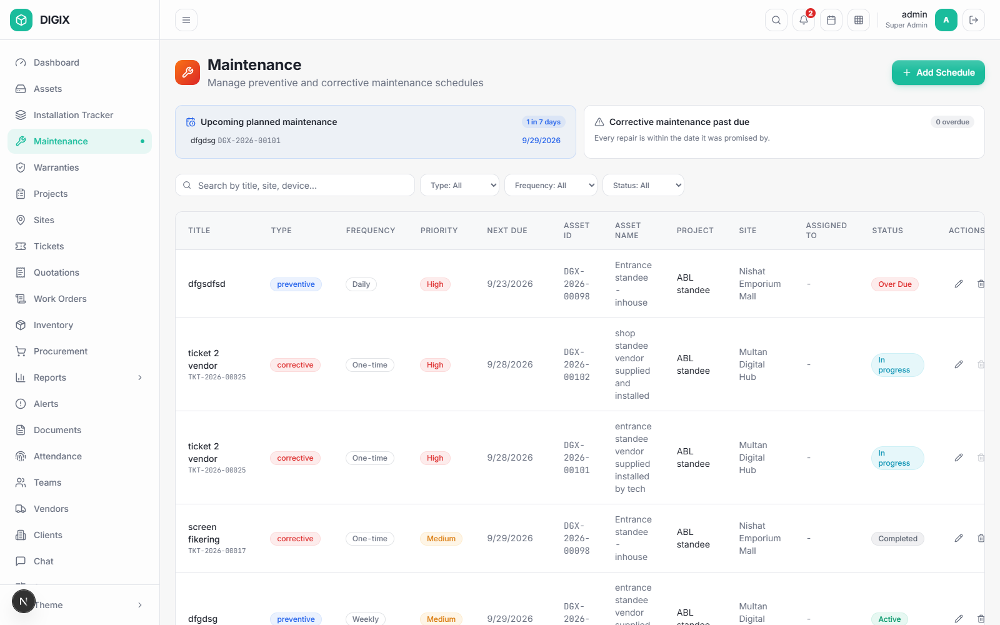

**Sidebar: Maintenance · Super Admin, Group Head, Operations Head,
Technician**

### 11.1 Two kinds

| | Preventive | Corrective |
|---|---|---|
| Why | Planned servicing | Something broke |
| Recurs | Yes — in rounds | No — one job |
| Starts from | A schedule you create | A ticket |

### 11.2 Rounds

A recurring schedule is worked **one round at a time**. Each round has its
own **assigned technician**, **due date** and **actual date** — because the
same person will not do every visit for the next two years.

The card shows **Next visit · round N** with **Start work** and **Complete
visit**. Below, **Past visits** lists every round already done.

### 11.3 Parts for a visit

*"The technician asks, a supervisor releases, the store issues."*

When you start a visit the system asks whether you need components. Raise a
request per component, choosing **Stock item** or **Unique item**. A
supervisor approves or rejects each line, then the store issues it.

### 11.4 Completing a visit

**Complete visit** asks for:

- **Components issued** — how many were **used**. Everything else goes back
  to the store, and the return appears in receiving under its own reference.
  For unique items you tick the individual serials going back
- Work done, cost, photos
- Whether it is **under warranty** or **billable**

Completing the visit opens the next round. A one-time job closes out.

---

## 12. Tickets

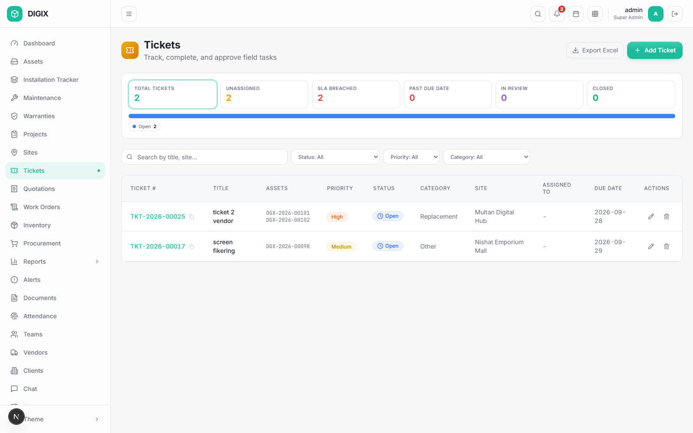

**Sidebar: Tickets · most roles**

A fault reported by anybody.

⚠ **Raising a ticket creates maintenance work.** A corrective maintenance
job opens automatically, the asset goes **Under Maintenance**, and it
returns to service when the job closes. You do not move the asset yourself.

⚠ **One ticket covering several assets produces one job per asset**, handled
separately — two screens with the same fault are two repairs.

---

## 13. Warranties

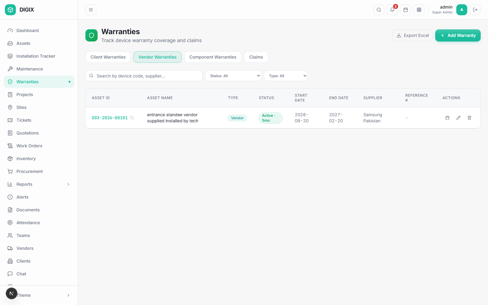

**Sidebar: Warranties · Super Admin, Group Head, Operations Head**

Two different things are called "warranty", and the system keeps them apart:

| | Covers | Given by |
|---|---|---|
| **Vendor / Component** | The asset or part coming in | Your supplier, to you |
| **Client** | The asset at the client's site | You, to your client |

Tabs: **Client Warranties · Vendor Warranties · Component Warranties ·
Claims**. Client-facing roles see a reduced set.

💡 A client warranty with a term in months re-anchors itself to the
installation date when the installation completes, so the cover starts when
the asset actually went live.

---

## 14. Everything else

### 14.1 Sites, Clients, Vendors

| Screen | Sidebar | For |
|---|---|---|
| **Sites** | Sites | Physical locations, with coordinates for the map |
| **Clients** | Clients | Who the work is for. Client IDs are generated |
| **Vendors** | Vendors | Suppliers, their terms and their warranties |

### 14.2 Quotations, Work Orders, Finance

| Screen | For |
|---|---|
| **Quotations** | Enquiry → quotation → negotiation → order confirmation |
| **Work Orders** | Internal jobs, approved against a value |
| **Finance** | Invoices and payments |

### 14.3 Team Management

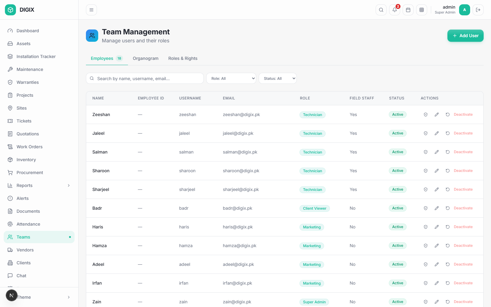

**Sidebar: Teams · anyone who may see the team**

Three tabs.

**Employees** — the roster. Each row has a shield button showing what that
person may do. Anyone may look; only the people in §4.3 may change it.

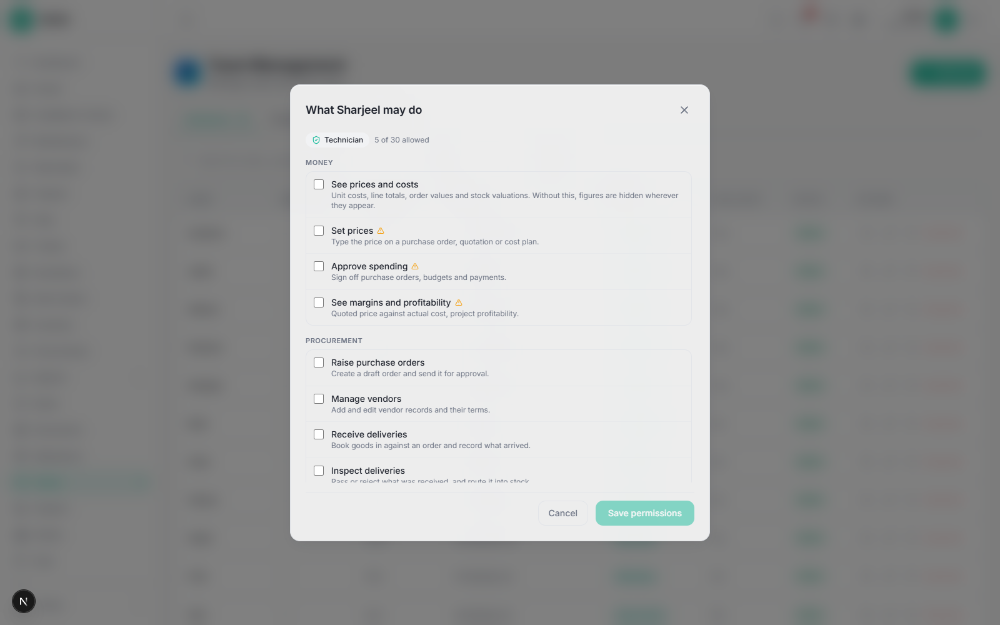

A row tinted amber differs from the role — it reads *granted · role says no*
or *withdrawn*, with who did it and why. **Back to what {role} allows**
resets the person.

**Organogram** — who reports to whom, drawn from each person's *Reports To*.

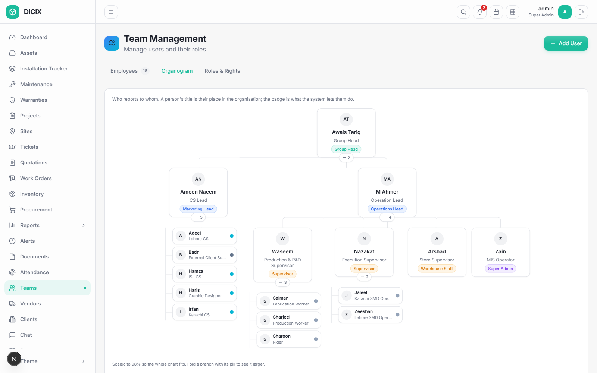

**Roles & Rights** — the whole grid: every role across the top, every
capability down the side.

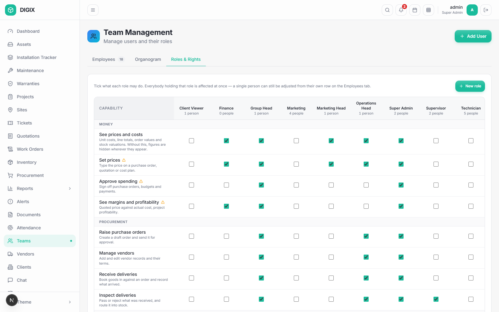

Tick a box and **everyone holding that role** gains it — each column says
how many people that is, and saves on its own. **New role** writes one from
scratch for a job you actually have.

⚠ A built-in role cannot be deleted, because accounts are stored against
it. A custom role can be, once nobody holds it.

### 14.4 Setup, Alerts, Documents, Attendance, Chat, Settings

| Screen | For |
|---|---|
| **Setup** | Reference data — asset types, models, material types, routes |
| **Alerts** | System alerts needing attention |
| **Documents** | The document library |
| **Attendance** | Registers and corrections |
| **Chat** | Internal messaging; the sidebar badge counts unread |
| **Settings** | Your profile, your password, your preferences |

---

# Part C — Doing the work

## 15. The six workflows end to end

### 15.1 Buying something

| # | Who | Where | Does |
|---|---|---|---|
| 1 | Project / Inventory | — | A requirement appears under **Procurement Requests** |
| 2 | Procurement | Procurement › Procurement Requests | Ticks the lines → **Raise PO** |
| 3 | Procurement | The PO form | Supplier, **Required Delivery**, prices, extra lines → **Raise draft PO** |
| 4 | Procurement | Purchase Orders | **Submit for Approval** |
| 5 | Group Head | Purchase Orders | **Approve** — this places the order and stamps its date |
| 6 | Store | Procurement | **Receive items** — records what arrived, with serials |
| 7 | Store / Supervisor | Inventory › Receiving | **Inspect** — pass into stock or reject |

### 15.2 Building an asset in-house

| # | Who | Where | Does |
|---|---|---|---|
| 1 | Operations | Assets | **Register Asset** — Name, Type, Route = In-house |
| 2 | Operations | Asset › Components | Defines what it is built from |
| 3 | Production | — | Requests components; the store issues them → **In Production** |
| 4 | Production | Production steps | Works the route |
| 5 | — | — | Build complete → **In Stock** |

### 15.3 Installing it

| # | Who | Where | Does |
|---|---|---|---|
| 1 | Operations | Asset › Next stage | Assigns it → **Assigned** |
| 2 | Operations | Installation Tracker | **New Installation** — site, installer, steps |
| 3 | Technician | Installation Tracker | Works the checklist |
| 4 | — | — | Checklist complete → **Installed** |
| 5 | Technician | Installation Tracker | **Mark Active** (photo required) → **Active** |
| 6 | Supervisor | Installation Tracker | **Handover** (signed document required) |

### 15.4 Keeping it running — planned

| # | Who | Where | Does |
|---|---|---|---|
| 1 | Operations | Maintenance | **Add Schedule** — asset, frequency, start date |
| 2 | Supervisor | The job | Assigns **round N** to a technician |
| 3 | Technician | The job | **Start work**; asks for components if needed |
| 4 | Supervisor | The job | Approves each part line |
| 5 | Store | Inventory | Issues them |
| 6 | Technician | The job | **Complete visit** — used vs returned, work done, cost |
| 7 | Store | Inventory › Receiving | Checks the returned parts back in |
| 8 | — | — | The next round opens automatically |

### 15.5 Keeping it running — a fault

| # | Who | Where | Does |
|---|---|---|---|
| 1 | Anyone | Tickets | Raises a ticket against the asset |
| 2 | System | — | Opens a corrective job per asset; asset → **Under Maintenance** |
| 3 | Technician | Maintenance | Works it, as §15.4 steps 3–6 |
| 4 | — | — | Job closes; the asset returns to service |

### 15.6 Running a project

| # | Who | Where | Does |
|---|---|---|---|
| 1 | Operations | Projects | Creates it — client, sites, target date |
| 2 | Operations | Project › Scope | Which assets, how many, where |
| 3 | Operations | Project › Planning | BOQ — what each is built from |
| 4 | Group Head | Project › Budget | Approves. ⚠ Parts list and route lock |
| 5 | — | — | Execution: build, install, hand over |
| 6 | — | — | The phase follows the work throughout |

---

# Part D — Reference

## 16. Reference

### 16.1 Asset statuses

| Status | Meaning |
|---|---|
| `In Procurement` | On order or awaiting purchase |
| `In Production` | Being built |
| `In Stock` | Built, ready to install |
| `Assigned` | Allocated to an installation |
| `Installed` | Physically up, not yet confirmed live |
| `Active` | Live at the client's site |
| `Under Maintenance` | Temporarily out of service |
| `Client Property` | Handed over to the client |
| `Decommissioned` | Retired |
| `In Transit` · `RMA` · `Lost/Stolen` | Off the normal line |

### 16.2 Rules the system will enforce

| Rule | Where |
|---|---|
| Name, Type and Manufacturing Route are required | Register Asset |
| An order cannot leave Draft without a Required Delivery date | Procurement |
| Only the Group Head or Super Admin approves an order | Procurement |
| Stock is issued only against a request | Inventory |
| A handed-over installation's steps cannot be changed | Installation |
| Marking active requires a photo | Installation |
| Recording handover requires the signed document | Installation |
| An approved project's parts list and route are locked | Projects |
| Nobody edits their own permissions | Teams |
| Nobody grants a capability they do not hold | Teams |
| A built-in role cannot be deleted | Teams |
| A custom role cannot be deleted while anyone holds it | Teams |

### 16.3 Screenshots in this manual

All images live in `docs/manual-images/`, named for the section they
illustrate. When a screen changes, re-take its screenshot at **1600 × 1000**
in the light theme, signed in as an administrator so the full sidebar shows,
and keep the filename. Then add a revision-history row.

### 16.4 Getting help

1. Check the rule in §16.2 — most surprises are a deliberate rule.
2. Check §4 — a missing button is usually a permission.
3. Ask your line manager; the organogram (§14.3) shows who that is.
4. Beyond that, raise it with the MIS Operator.

---

*End of document — DIGIX-UM-001 v1.0, 28 September 2026.*
